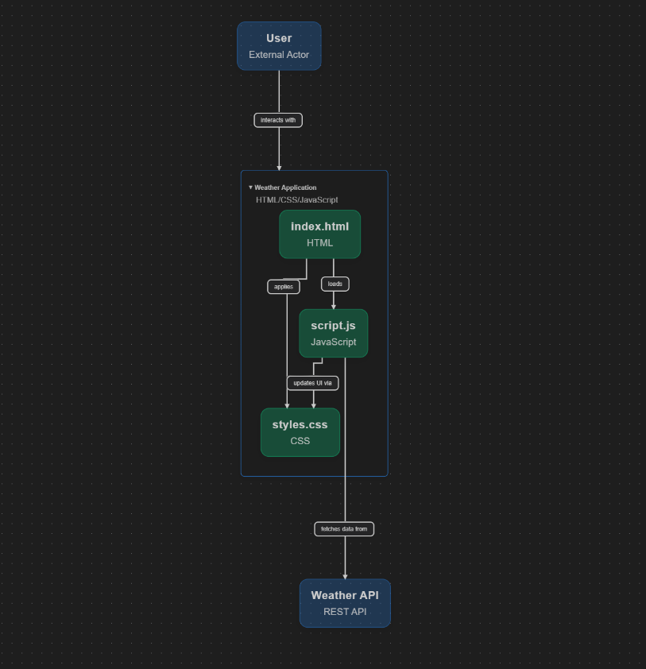

# Grupo 4 - Consulta de Clima

## 🎯 Product Backlog
Crear una aplicación web que consulte el Clima de una ciudad y Pais

## 🎯 Sprint Goal
Desarrollar una aplicación web que muestre de forma clara y visual el clima actual de cualquier ciudad o país ingresado
## 👥 Roles Scrum

| Rol            | Integrante        | Función principal                                                                             |
|------------------|--------------------|----------------------------------------------------------------------------------------------|
| Scrum Master     | Sebastian Perez    | Facilita el proceso Scrum, eliminar impedimentos y asegurar que el equipo siga los principios ágiles.                                              |
| Product Owner    | Maurice Chavez     | Definir requisitos, priorizar funcionalidades y establecer las metas del proyecto           |
| Developer 1      | Adrian Sirlopu        | Desarrolla la estructura HTML y la lógica JavaScript para mostrar datos en la interfaz, Aplica el TDD e Integra Pair Programming.                                                    |
| Developer 2      | Axel Romero    | Diseña los estilos CSS, integra la aplicación con la API externa, asegura la Integración Continua (CI) y el despliegue rápido.                                                |

## ⚙️ Funcionalidades

- Mostrar el nombre de la ciudad y el país consultado.
- Presentar la temperatura actual de la ciudad.
- Indicar la condición climática (ej. soleado, nublado, lluvia).
- Mostrar el porcentaje de humedad del aire.
- Visualizar la fecha actual de la consulta.

## 🛠 Tecnologías Utilizadas

  
  
  

## 📁 Estructura del Proyecto
- Aplicacion-Clima
  - index.html
  - script.js
  - README.md
  - styles.css
